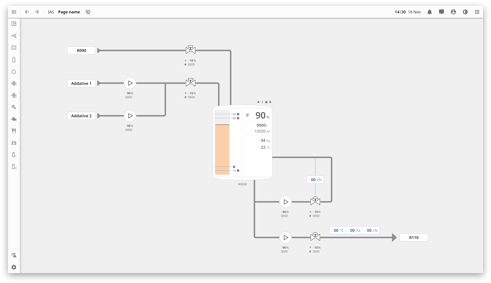
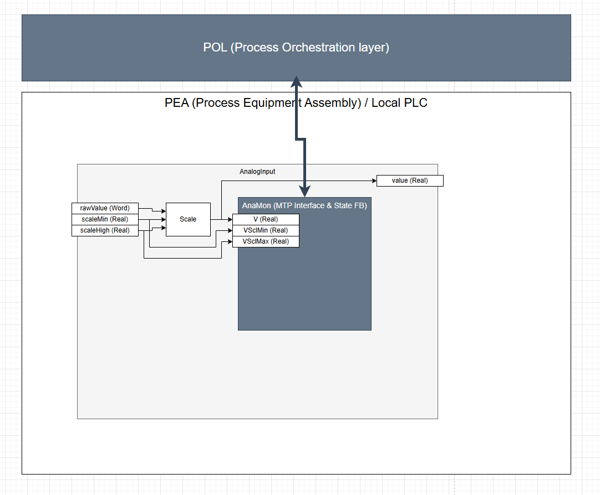
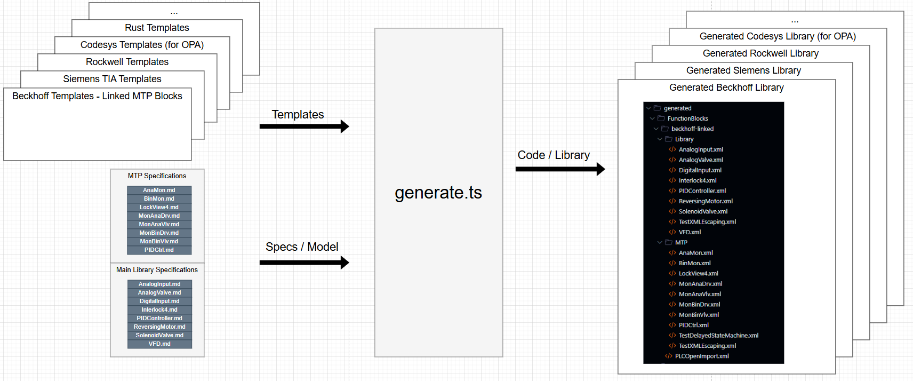

```
 ██████╗  ██████╗  ███████╗ ███╗   ██╗     ██████╗  ██████╗   ██████╗   ██████╗ ███████╗ ███████╗ ███████╗  
██╔═══██╗ ██╔══██╗ ██╔════╝ ████╗  ██║     ██╔══██╗ ██╔══██╗ ██╔═══██╗ ██╔════╝ ██╔════╝ ██╔════╝ ██╔════╝  
██║   ██║ ██████╔╝ █████╗   ██╔██╗ ██║     ██████╔╝ ██████╔╝ ██║   ██║ ██║      █████╗   ███████╗ ███████╗  
██║   ██║ ██╔═══╝  ██╔══╝   ██║╚██╗██║     ██╔═══╝  ██╔══██╗ ██║   ██║ ██║      ██╔══╝   ╚════██║ ╚════██║  
╚██████╔╝ ██║      ███████╗ ██║ ╚████║     ██║      ██║  ██║ ╚██████╔╝ ╚██████╗ ███████╗ ███████║ ███████║  
 ╚═════╝  ╚═╝      ╚══════╝ ╚═╝  ╚═══╝     ╚═╝      ╚═╝  ╚═╝  ╚═════╝   ╚═════╝ ╚══════╝ ╚══════╝ ╚══════╝  

██╗      ██╗ ██████╗  ██████╗   █████╗  ██████╗  ██╗   ██╗
██║      ██║ ██╔══██╗ ██╔══██╗ ██╔══██╗ ██╔══██╗ ╚██╗ ██╔╝
██║      ██║ ██████╔╝ ██████╔╝ ███████║ ██████╔╝  ╚████╔╝
██║      ██║ ██╔══██╗ ██╔══██╗ ██╔══██║ ██╔══██╗   ╚██╔╝
███████╗ ██║ ██████╔╝ ██║  ██║ ██║  ██║ ██║  ██║    ██║
╚══════╝ ╚═╝ ╚═════╝  ╚═╝  ╚═╝ ╚═╝  ╚═╝ ╚═╝  ╚═╝    ╚═╝
```

# Call for Collaboration

This project is looking for collaboration.  
What we need:
- [ ] automation experts (PLC & DCS)
- [ ] HMI/SCADA experts
- [ ] owners and end-users (for making clear what is needed to let this be adopted at scale in your plants)
- [ ] system integrators
- [ ] automation vendors (for adopting this as a cross-ecosystem standard)
- [ ] individual contributors
- [ ] Educators (for using Open Process Library in your courses)

Contact: #open-process-library on the [SASE Slack](https://sase.space/) 

# Supporting Companies

|Company|Description|
|---|---|
|[](https://acceleer.com)| Collaborative Design & Code Generation (DesignOps) for Industrial Process Automation |
|[](https://loupe.team/)| Revolutionizing Industrial Automation (and powering [SASE](https://sase.space/) ) |

Contact us to be added here and under wat form (System Integrator, Automation Vendor, ...)

# Introduction

Process Automation goes back more than 50 years. When the first PLC and DCS systems came to the market they were ahead of their time. They were as advanced as the personal computers of their age. Yet in the last 20 years it feels progress has stalled. Software has eaten the world, yet it has broken its teeth on industrial automation.
The ecosystem over the years built solid walls around countless closed and proprietary systems, each programmed with an IEC-61131 dialect only running on the specific system.

Today users stare in wonder to these walls that slow down digitization and limit scalability.
Will AI bring a solution?
But this is industry: we run critical processes that need to be reliable and deterministic at all times. We cannot just let the new AI agents have free reign at it.

The solution is to go back to the basics: build the tools, standards and building blocks that allow software systems to get a grip.

A big effort has already been done by some dedicated owners to bring [Open Process Automation](https://www.opengroup.org/forum/open-process-automation-forum) into life.

The next puzzle piece that is missing is the first thing that everyone needs when starting a Process Automation project: a library of process automation objects.
Function blocks, icons and faceplates for valves, motors, measurements, PID controller, ...
DCS systems often bring these out-of-the box, although with a closed source and licenses, and no ability and permission to standardize them over multiple systems.
And for the long tail of Process Automation implemented by PLC + SCADA there is a huge variety of libraries, with each system integrator bringing their own, and the occasional owner having an own standard.

A couple of initiatives have already taken a first step in trying to improve this:

1/ The [Siemens Open Library](https://openplclibrary.com/) by DMC. [license](https://openplclibrary.com/#license)

This libary has been openly available to use by anyone, focused on the Siemens TIA system.

2/ The new [Module Type Package](https://www.profibus.com/technologies/mtp) standard, bringing modularization to process industry.

The future of Process Automation is also modular. And this is also only possible if the interfaces to the Process Objects is standardized.
The MTP team has, as part of defining their overall standard, already done the work of destilling out these interfaces based on what is common practice in Process Industry.
However MTP does not provide any library, and leaves this to the vendors and system integrators to implement.

3/ In the niche of (Industrial) maritime workplaces [OpenBridge](https://www.openbridge.no/) has done a tremendous job already of building an open UI interface to enhance the design, implementation and approval of industrial workplaces and equipment.  It is built upon modern user interface (UI) principles, industry regulations, and human-centered design practices. The system was originally built for maritime use cases but has evolved to support a wide range of industrial cases.


Open Process Library takes the next step, and builds:
- an open licensed library (MIT)
- open source
- collaborative
- implements the MTP interface for the Data Assemblies
- cross-vendor, both for legacy/current systems as well for the new OPA-based systems

# Getting Started

Note: THIS IS WORK IN PROGRESS.
The draf code generation workflow for the PLC blocks is ready.
Nothing has been done for the HMI side, except some design concepts.

## Import in Beckhoff TwinCat (early draft version!)

- download this file: [PLCOpenImport.xml](generated/FunctionBlocks/beckhoff-linked/PLCOpenImport.xml)
- Open TwinCat
- Right Click on the Project in the tree view > Import PLCOpenXML

Note: 
When using Beckhoff's MTP Runtime it is possible to use Beckhoff's version of the blocks instead: [TwinCAT MTP Runtime](https://infosys.beckhoff.com/content/1033/tf8400_tc3_mtp_runtime/14869060363.html?id=1772271480501640677)
These get auto-generated.
In that case use this file to import OPL instead: [PLCOpenImport_UsingTwinCAT_MTP_Blocks.xml](generated/FunctionBlocks/beckhoff-linked/PLCOpenImport_UsingTwinCAT_MTP_Blocks.xml)

## Other Systems

coming soon...
Have an urgent request?
Come to the Slack: [SASE Slack](https://sase.space/): #open-process-library

## Generate the library

- Clone the project
- Install Deno
- Run:
```
deno run --allow-read --allow-write ./scripts/generate.ts
```
- Alternative for running with a post-generate script (in WSL):
```
deno run --allow-read --allow-write --allow-run ./scripts/generate.ts
```


# Block Priority Table

The initial focus and priority is on these 8 blocks, covering more than 80% of the use cases:  
(Click on a block to see the detailed design specification)

| Block Name                                        | MTP Block Name                      | MTP Parent Type          | Description                                                          | DMC Block Name       | Priority |
| ------------------------------------------------- | ----------------------------------- | ------------------------ | -------------------------------------------------------------------- | -------------------- | -------- |
| [DigitalInput](specs/Library/DigitalInput.md)     | [BinMon](specs/MTP/BinMon.md)       | IndicatorElement\BinView | display a binary value                                               | fbIO_DigitalInput    | 1        |
| [AnalogInput](specs/Library/AnalogInput.md)       | [AnaMon](specs/MTP/AnaMon.md)       | IndicatorElement\AnaView | display an analogue value                                            | fbIO_AnalogInput (1) | 1        |
| [SolenoidValve](specs/Library/SolenoidValve.md)   | [MonBinVlv](specs/MTP/MonBinVlv.md) | ActiveElement\BinVlv     | bistable valve                                                       | fbValve_Solenoid     | 1        |
| [AnalogValve](specs/Library/AnalogValve.md)       | [MonAnaVlv](specs/MTP/MonAnaVlv.md) | ActiveElement\AnaVlv     | analogue valve                                                       | fbValve_Analog (2)   | 1        |
| [ReversingMotor](specs/Library/ReversingMotor.md) | [MonBinDrv](specs/MTP/MonBinDrv.md) | ActiveElement\BinDrv     | fixed speed drive with both clockwise and anti-clockwise rotation    | fbMotor_Reversing    | 1        |
| [VFD](specs/Library/VFD.md)                       | [MonAnaDrv](specs/MTP/MonAnaDrv.md) | ActiveElement\AnaDrv     | variable speed drive with both clockwise and anti-clockwise rotation | fbVFD_Analog         | 1        |
| [PIDController](specs/Library/PIDController.md)   | [PIDCtrl](specs/MTP/PIDCtrl.md)     | ActiveElement            | continuous PID controller                                            | fbPID_Compact        | 1        |
| [Interlock4](specs/Library/Interlock4.md)         | [LockView4](specs/MTP/LockView4.md) | DiagnosticElement        | visualize the current state of 4 locks                               | fbInterlock (3)      | 1        |

# Demo Screen



# Nested Architecture with MTP Wrapping

The MPT interface definitions and functionality get us ~80% of what is needed.
Some vendors provide standard function blocks, in some cases part of a partial code generation pipeline (for example Beckhoff).

To complete the needed functionality OPL (Open Process Library) has a layered architecture where the OPL blocks wrap the MTP interface blocks.
The target is to support both vendor-supplied blocks, and also provide an open alternative for the MTP blocks.

For example a typical AnalogInput block needs a raw value that is properly scaled.
Also the scaled value needs to be available both on MTP, as well as an output on the AnalogInput block for usage in the rest of the program:



# Task List

- [x] Define initial specs
- [ ] Kick off UI Design Workstream
- [ ] Kick off Automated PLC Engineering Workstream

Want to help? Come talk on the [SASE Slack](https://sase.space/): #open-process-library

# Code Generation Pipeline

There are almost more IEC-61131 dialects than modern programming languages.
Almost every IDE expects the code in a slightly different format.

A project like Open Process Library that aims to support any system is only feasible if the code gets automatically generated.

SPEC > CODE is where we are coing with coding agents.
But SPEC > CODE is also possible with a deterministic code generation workflow.

The Function Blocks are described in markdown tables, describing both the interfaces and functionality.

Independently the code generation templates are built for every target system:
- FunctionBlockTemplate.nunjucks: describes how one FunctionBlock should be generated
- ImportTemplate.nunjucks: describes how the FunctionBlocks should be combined in a single import file to the target IDE

Then we calls scripts/generate.ts that reads both the markdown Specs + Templates, and generates the library code for each target system.

Try yourself from the root folder: (install deno for it to work)
```
deno run --allow-read --allow-write ./scripts/generate.ts
```



# Full Block List

| Block Name                                        | MTP Block Name                      | MTP Parent Type             | MTP Description                                                      | DMC Block Name       | Priority |
| ------------------------------------------------- | ----------------------------------- | --------------------------- | -------------------------------------------------------------------- | -------------------- | -------- |
|                                                   | IndicatorElement                    |                             | visualise PEA-internal values in the POL                             |                      |          |
|                                                   | BinView                             | IndicatorElement            | display a binary value of the PEA                                    |                      |          |
| [DigitalInput](specs/Library/DigitalInput.md)     | [BinMon](specs/MTP/BinMon.md)       | IndicatorElement\BinView    | extends BinView with fluttering signal monitoring                    | fbIO_DigitalInput    | 1        |
|                                                   | DIntView                            | IndicatorElement            | display an integer varlue of the PEA                                 |                      |          |
|                                                   | DIntMon                             | IndicatorElement\DintView   | extends DIntView with limit check                                    |                      | 2        |
|                                                   | AnaView                             | IndicatorElement            | display an analogue value of the PEA                                 |                      |          |
| [AnalogInput](specs/Library/AnalogInput.md)       | [AnaMon](specs/MTP/AnaMon.md)       | IndicatorElement\AnaView    | extends AnaView with limit check                                     | fbIO_AnalogInput (1) | 1        |
|                                                   | StringView                          | IndicatorElement            | display a dynamic string from the PEA                                |                      |          |
|                                                   | OperationElement                    |                             | used to transfervalues from the POL to the PEA                       |                      | 2        |
|                                                   | BinMan                              | OperationElement            | set or reset a binary value in the PEA                               |                      |          |
|                                                   | BinManInt                           | OperationElement\BinManInt  | extends BinMan with internal value and Sourcemode                    |                      | 2        |
|                                                   | DIntMan                             | OperationElement            | transfer an integer value from POL into PEA                          |                      |          |
|                                                   | DIntManInt                          | OperationElement\DIntMan    | extends AnaMan with internal value and SourceMode                    |                      | 2        |
|                                                   | AnaMan                              | OperationElement            | transfer an analogue value from POL into PEA                         |                      |          |
|                                                   | AnaManInt                           | OperationElement\AnaMan     | extends AnaMan with internal value and SourceMode                    |                      | 2        |
|                                                   | ActiveElement                       |                             | allow the POL level to access active elements of the PEA             |                      |          |
|                                                   | BinVlv                              | ActiveElement               | bistable valve                                                       |                      |          |
| [SolenoidValve](specs/Library/SolenoidValve.md)   | [MonBinVlv](specs/MTP/MonBinVlv.md) | ActiveElement\BinVlv        | extends BinVlv with feedback monitoring                              | fbValve_Solenoid     | 1        |
|                                                   | TriPosVlv                           | ActiveElement               | tristable valve                                                      |                      |          |
|                                                   | MonTriPosVlv                        | ActiveElement\TriPosVlv     | extends TriPosVlv with feedback monitoring                           |                      |          |
|                                                   | AnaVlv                              | ActiveElement               | analogue valve                                                       |                      |          |
| [AnalogValve](specs/Library/AnalogValve.md)       | [MonAnaVlv](specs/MTP/MonAnaVlv.md) | ActiveElement\AnaVlv        | extends AnaVlv with feedback monitoring                              | fbValve_Analog (2)   | 1        |
|                                                   | BinDrv                              | ActiveElement               | fixed speed drive with both clockwise and anti-clockwise rotation    |                      |          |
| [ReversingMotor](specs/Library/ReversingMotor.md) | [MonBinDrv](specs/MTP/MonBinDrv.md) | ActiveElement\BinDrv        | extends BinDrv with feedback monitoring                              | fbMotor_Reversing    | 1        |
|                                                   | AnaDrv                              | ActiveElement               | variable speed drive with both clockwise and anti-clockwise rotation |                      |          |
| [VFD](specs/Library/VFD.md)                       | [MonAnaDrv](specs/MTP/MonAnaDrv.md) | ActiveElement\AnaDrv        | extends AnaDrv with feedback monitoring                              | fbVFD_Analog         | 1        |
| [PIDController](specs/Library/PIDController.md)   | [PIDCtrl](specs/MTP/PIDCtrl.md)     | ActiveElement               | continuous PID controller                                            | fbPID_Compact        | 1        |
|                                                   | DiagnosticElement                   |                             | used to display diagnostic information in the POL                    |                      |          |
| [Interlock4](specs/Library/Interlock4.md)         | [LockView4](specs/MTP/LockView4.md) | DiagnosticElement           | visualize the current state of 4 locks                               | fbInterlock (3)      | 1        |
|                                                   | LockView8                           | DiagnosticElement\LockView4 | visualize the current state of 8 locks                               |                      | 2        |
|                                                   | LockView16                          | DiagnosticElement\LockView8 | visualize the current state of 16 locks                              |                      | 2        |
|                                                   |                                     |                             |                                                                      | fbIO_AnalogOutput    | 2        | (4)
|                                                   |                                     |                             |                                                                      | fbIO_DigitalOutput   | 2        | (5)
|                                                   |                                     |                             |                                                                      | fbFlowTotalizer      | 2        | (6)

(1) also see fbLevelMonitor, fbHopperLevel
(2) also fbValve_Hydraulic
(3) also fbPermissive
(4) maybe AnaDrv, or AnaMan?   
(5) maybe BinVlv, but it's not a valve. Or BinMan?
(6) maybe AnaView       


## Naming Guideline

Naming guidelines: Ninja Monkeys Style Guide https://ekvip.de/style-guide/Naming.html
